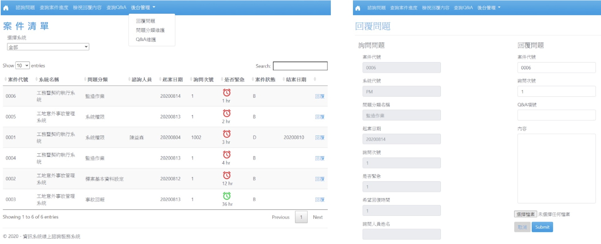

# Application System Consultation Service Platform

- [繁體中文版](README_zh.md)
- An Application System Consultation Service Platform built with ASP.NET MVC 5.




## System Requirements

- IDE: Visual Studio 2019 or 2022
- Database (if used): SQL Server / SQL Server Express / LocalDB


## Project Structure
```bash
US5NET/                              — Project root (GitHub repo root)
├─ QuerSyst/                         — ASP.NET MVC 5 web project (main application code)
│  ├─ App_Start/                     — Startup & global configuration (registration points for RouteConfig, FilterConfig, BundleConfig)
│  ├─ Content/                       — Front-end styles & static assets (CSS, fonts, images)
│  ├─ Controllers/                   — Controllers: handle use-case flow, validate input, return View/Json/File
│  ├─ FileUploads/                   — Server storage for uploaded files (consultation attachments; served via a download Action)
│  ├─ Models/
│  │  └─ US/                         — Domain models & ViewModels/DTOs (categories, questions, QA items, attachments, field validations)
│  ├─ Properties/                    — Project properties & assembly metadata (AssemblyInfo)
│  ├─ Scripts/                       — Front-end JS (search/pagination, form validation, AJAX calls, interaction logic)
│  ├─ Views/                         — Razor views; Shared/_Layout.cshtml is the site-wide layout
│  ├─ images/                        — Site image assets (logo, illustrations, icons)
│  ├─ Global.asax                    — Application entry; Application_Start() registers routes/filters/bundles
│  ├─ Global.asax.cs                 — Code-behind for Global.asax
│  ├─ US5NET.csproj                  — Project file (compile items, configurations, target .NET Framework)
│  ├─ Web.Debug.config               — Debug transform (local/test configuration)
│  ├─ Web.Release.config             — Release transform (production configuration)
│  └─ Web.config                     — Core settings (connection strings, appSettings, auth/authorization, IIS behavior/limits)
├─ .gitattributes                    — Git attributes: EOL normalization, merge strategies, LFS specifications (if any)
├─ .gitignore                        — Ignore rules for build/IDE/user files (bin/obj, .vs, *.user, packages/, etc.)
└─ US5NET.sln                        — Visual Studio solution (loads/manages the solution and configurations)
```
